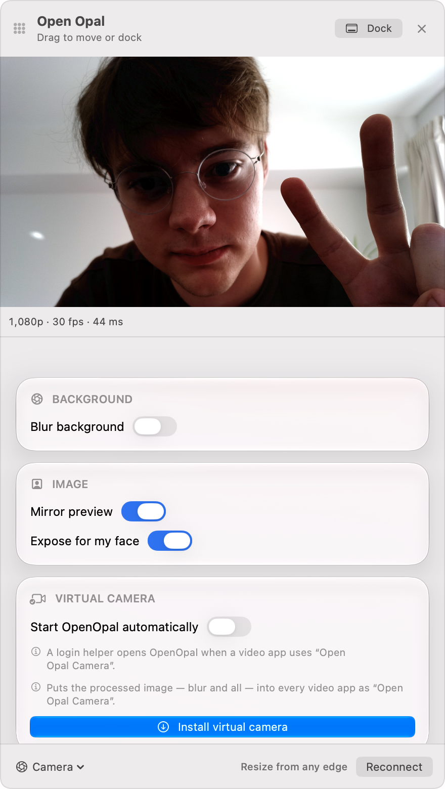

# Open Opal

A native macOS app for the Opal C1 webcam. Opal discontinued the C1 and its
Composer software; Open Opal keeps the camera working, and adds a few things.



- Full camera control: exposure, focus, white balance, image tuning, 4K/1080p/720p
- Background blur
- A virtual camera, **Open Opal Camera**, for Zoom, Meet, FaceTime and the rest
- Lives in the menu bar; drag the panel off to float it
- About 45 ms from lens to screen

Runs on Apple silicon Macs with macOS 14 or later. Nothing is written to the
camera: quit Open Opal and it goes back to being a normal webcam.

## Install

Download the latest DMG from [Releases](https://github.com/alii/open-opal/releases)
and drag Open Opal to Applications. Click the lens icon in the menu bar to
open it, and right-click the icon to quit.

To use the virtual camera, click **Install virtual camera** and allow it in
System Settings if asked.

## Building

```sh
brew install cmake ninja xcodegen
./scripts/bootstrap.sh
./scripts/fetch-models.sh
xcodegen generate
open OpenOpal.xcodeproj
```

Building needs Xcode 27. See [TECHNICAL.md](TECHNICAL.md) for details, tests,
and how the camera takeover works.

## Thanks

A huge thank you to [Jamie Dubs](https://github.com/jamiew), who added
support for first-generation IMX378 C1s, follow-face autofocus with lens range
limits, custom camera tuning files, the detachable menu bar panel, the virtual
camera format fix, readable sensor names and CI. Thanks also to
[Niek](https://github.com/Niek) for the bundling fixes, saved settings and
auto-start.

## License

MIT. Not affiliated with Opal Camera Inc. Thanks to Luxonis for DepthAI, and
to Opal for building the C1 on an open platform in the first place.
